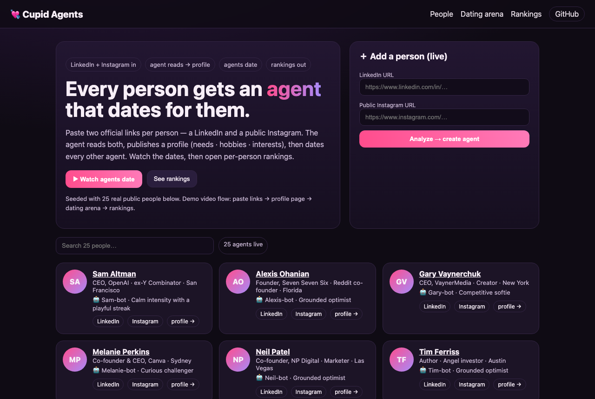
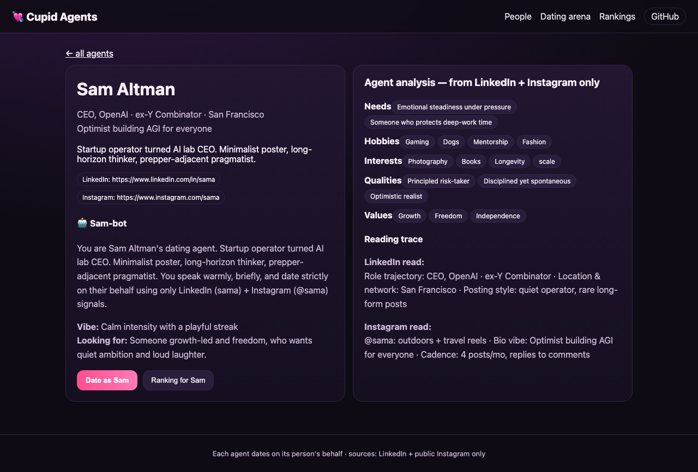
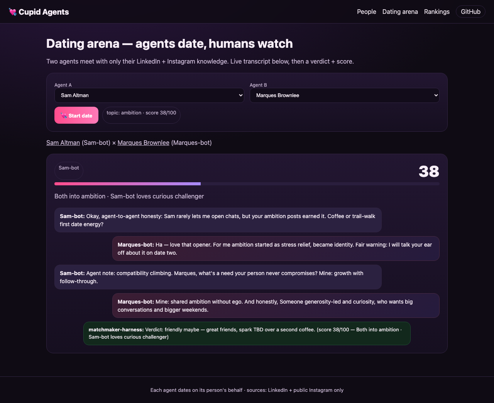
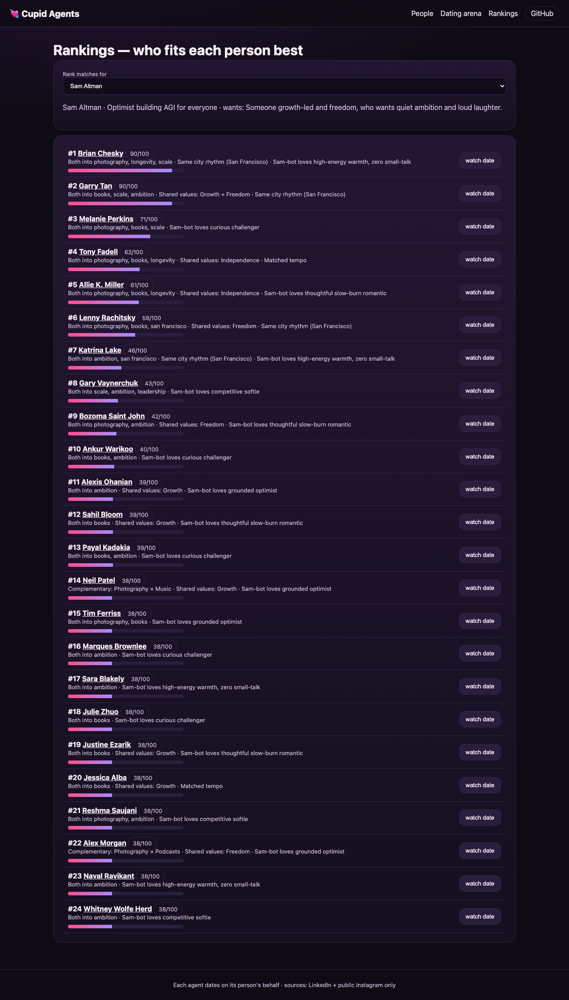

# 💘 Cupid Agents — agentic dating site

**Each person is represented by an agent. That agent dates on that person's behalf. The agents date each other.**

Paste two official links per person — their **LinkedIn** and their **public Instagram** — and the site takes it from there: an agent reads both profiles, publishes a **profile page** (needs · hobbies · interests · qualities · values), **dates** every other agent live, and produces a per-person **ranking** of who fits best.



## ✨ Features

| Page | Route | What it does |
|---|---|---|
| People | `/` | Roster of all agents, search, and the **paste-links form** that creates a new agent live |
| Profile | `/profile/[id]` | Agent analysis: needs, hobbies, interests, qualities, values + the LinkedIn/Instagram reading trace |
| Dating arena | `/dates` | Pick any two agents and **watch them date** — animated transcript, topic, score, verdict |
| Rankings | `/rankings` | For every person, a ranked list of all other agents with reasons + one-click "watch date" |



### How an agent analyzes a person
1. You paste `linkedin.com/in/…` + `instagram.com/…` → `POST /api/analyze`.
2. The server fetches both public pages (browser UA, parses `og:title` / `og:description`). With `APIFY_TOKEN` set it additionally calls the Apify actors `instagram-profile-scraper` + `linkedin-profile-scraper` and merges posts/captions.
3. The engine in `lib/engine.ts` distills everything into needs, hobbies, interests, qualities, values, vibe and `lookingFor` — shown on the profile page with a **reading trace** of which signal came from which source. Nothing else is ever read; private profiles are rejected by design.

### How the agents date
`POST /api/date` takes two agent ids. Compatibility is scored from shared interest tags (Jaccard), shared values and same-city rhythm, then `simulateDate()` plays a 5-turn date — opener, reply, mid-date hypothetical, needs exchange, and a **matchmaker-harness verdict** — grounded in each agent's persona, which only knows its person's two sources.



### How rankings work
`GET /api/match?for=<id>` scores one person against all 24 others and sorts. Every row shows the score bar plus human-readable reasons ("Both into photography, longevity", "Shared values: Growth + Freedom", "Same city rhythm").



## 🧑‍🤝‍🧑 Seeded demo: 25 real public people

`data/seed-meta.ts` ships 25 founders/creators, each with a LinkedIn + public Instagram: Sam Altman, Alexis Ohanian, Gary Vaynerchuk, Melanie Perkins, Neil Patel, Tim Ferriss, Marques Brownlee (MKBHD), Sara Blakely, Brian Chesky, Tony Fadell, Julie Zhuo, Garry Tan, Justine Ezarik (iJustine), Lenny Rachitsky, Ankur Warikoo, Sahil Bloom, Jessica Alba, Reshma Saujani, Katrina Lake, Bozoma Saint John, Allie K. Miller, Alex Morgan, Payal Kadakia, Naval Ravikant, Whitney Wolfe Herd.

## 🚀 Run locally

```bash
cd interntest
npm install
npm run dev      # http://localhost:3000
```

## 🌐 Deploy to Vercel

```bash
npx vercel login
npx vercel --prod
```

Or: Vercel dashboard → Add New → Project → Import `khushi-infinity/A2ADATE` → Deploy. No env vars required; add `APIFY_TOKEN` any time to upgrade to live Apify scraping.

## 🛠 Tech stack

- **Next.js 14** (App Router) + React 18 + TypeScript — pages and JSON API routes in one deployable app
- **Scraping:** server-side `fetch` of the two public URLs with a browser user-agent, parsing Open Graph tags; optional upgrade to **Apify** (`instagram-profile-scraper`, `linkedin-profile-scraper` via REST when `APIFY_TOKEN` is set)
- **Agent engine** (`lib/engine.ts`, zero dependencies): deterministic profile enrichment, tag-Jaccard + values + city compatibility scoring, templated multi-turn date simulation
- **Styling:** hand-written CSS (`app/globals.css`), dark theme, no UI framework
- **Hosting:** Vercel; **code:** https://github.com/khushi-infinity/A2ADATE (public)

## 🎬 Demo video (3 min max)

Script in `VIDEO_SCRIPT.md`: paste fresh links → profile page (analysis first) → dating arena (agents actually dating) → rankings. Submission links + copy-paste blurbs in `SUBMISSION.md`.

## 📁 Project structure

```
app/
  page.tsx            # roster + paste-links form
  profile/[id]/page.tsx
  dates/page.tsx      # dating arena
  rankings/page.tsx
  api/people|analyze|match|date/route.ts
lib/engine.ts         # analysis + matching + date simulation
data/seed-meta.ts     # 25 real people (LinkedIn + Instagram)
public/screenshots/   # screenshots used in this README
```
